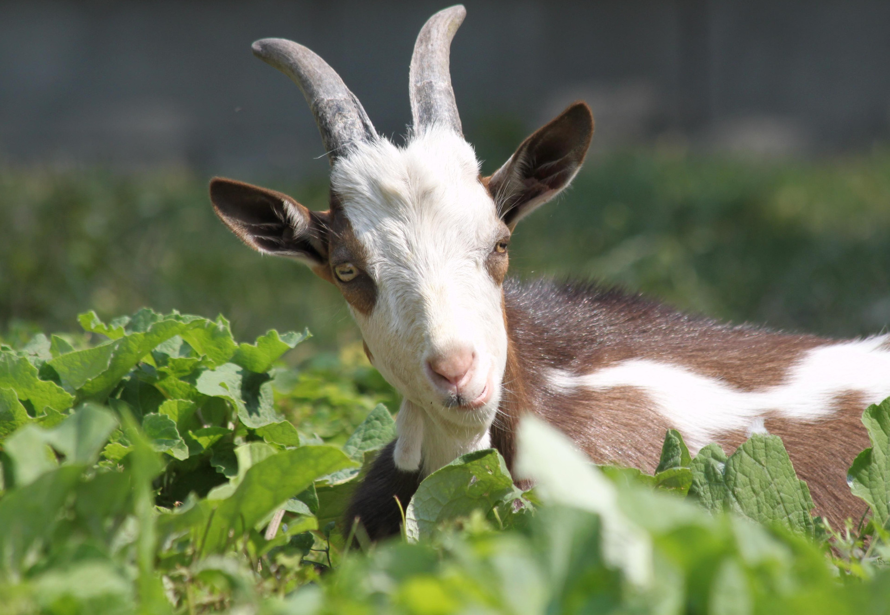

# Index

- [Pourquoi Mr.Conoir est vraiment THE goat](#pourquoi-mrconoir-est-vraiment-the-goat)
  - [Introduction : Qu'est ce qu'un goat ?](#quest-ce-quun-goat)
  - [Pourquoi Mr.Conoir serait donc THE goat ?](#pourquoi-mrconoir-serait-donc-the-goat-)
    - [Dans le domaine de l'informatique](#dans-le-domaine-de-linformatique)
    - [Quid de la personne elle même ?](#quid-de-la-personne-elle-même-)
  - [Comparaison](#comparaison)
- [Conclusion](#conclusion)

# Pourquoi Mr.Conoir est vraiment THE goat ?

## Introduction : Qu'est ce qu'un goat ?

En anglais, "GOAT" est un acronyme pour "Greatest Of All Time", ce qui signifie "le plus grand de tous les temps". C'est une expression utilisée pour désigner quelqu'un qui est considéré comme le meilleur dans un domaine particulier, souvent utilisé dans le contexte du sport, de la musique ou d'autres domaines de performance.

## Pourquoi Mr.Conoir serait donc THE goat ?

Maintenant que l'on a en contexte ce que signifie goat,passons aux explication pour Mr Conoir.

### Dans le domaine de l'informatique

- Il a de très bonne connaissance informatique,notamment en MarkDown et python

- Il a également un site personnel dédié à l'apprentissage et initiation au codage pour ses élèves

*Site non représentatif ne retrouvant pas le site original ..*

- Il fut mon professeur de NSI au lycée et également celui qui m'a transmi la passion (la joie de l'argent) de l'informatique

### Quid de la personne elle même ?

- Il est une personne pratiquant beaucoup l'humour

  
<em><u>Exemple :</u></em> "Monsieur,mon code ne marche pas","Normal,il n'a pas de code jambe🥁"

- Une personne très impliquée dans ce qu'elle fait : beaucoup aider ses élèves, rire avec eux.

- Un très bon organisateur d'emploi du temps.

## Comparaison
**Qu'en est-il comparé à son élève Lecoustre Malcom ?**

| X  	|   Lecoustre Malcom	|   Mr.Conoir	|
|---	|---	|---	|
|  Métier 	|   Non	|   Professeur à l'IUT	|
|   Humour	|   Très bon	|   Excellent	|
|   Moto	|   N'en a pas	|   En a une	|
|   Nutrition	|   Malbouffe	|   Mange sain	|
|   Sport	|   Pratique en son temps libre	|   ???	|
|   Informatique	|   Copilote/ChatGPT	|   Très bon	|
|   Présence	|   Santé de merde	|   Toujours	|

- - -

# Conclusion

En résumé, Mr. Conoir se distingue par ses compétences exceptionnelles en informatique, son dévouement envers ses élèves, et son sens de l'humour unique. Il a non seulement transmis sa passion pour l'informatique à ses élèves, mais il a également su créer un environnement d'apprentissage agréable et motivant. Comparé à son élève Lecoustre Malcom, Mr. Conoir excelle dans plusieurs domaines, notamment en termes de professionnalisme, de nutrition, et de présence constante. Ces qualités font de lui un véritable "GOAT" dans son domaine, et un modèle à suivre pour ses élèves.