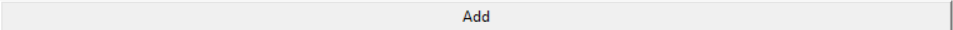
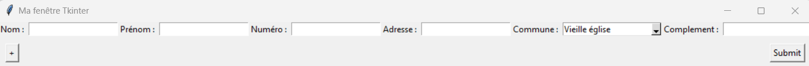
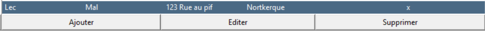
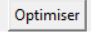

# Index

- [Introduction](#introduction)
- [Utilisation](#utilisation)
  - [Lancer l'application](#lancer-lapplication)
  - [Manipulation de données](#manipulation-de-données)
    - [Ajout d'une personne](#ajout-dune-personne)
      - [Rajouter une personne dans le json (ajout à l'application sans association précise)](#rajouter-une-personne-dans-le-json-ajout-à-lapplication-sans-association-précise)
      - [Rajouter une personne à un trajet](#rajouter-une-personne-à-un-trajet)
    - [Retirer une personne](#retirer-une-personne)
      - [Retirer une personne de l'application](#retirer-une-personne-de-lapplication)
      - [Retirer une personne du trajet](#retirer-une-personne-du-trajet)
    - [Modifier une personne](#modifier-une-personne)
  - [Traitement de données](#traitement-de-données)
  - [Bonus](#bonus)

# Introduction

Cette documentation est écrite afin de vous accompagner dans l'utilisation de mon application ayant pour but d'optimiser un parcours routier entre différentes adresse afin d'effectuer une livraison ayant tous le même départ.
Je l'ai développé lors de mon stage

# Utilisation

## Lancer l'application

## Manipulation de données

Dans un premier temps,il faut pouvoir manipuler les données afin de pouvoir les traiter ,et voici donc les possibilités :

### Ajout d'une personne

Il y a 2 types d'ajout de personne

**1. Rajouter une personne dans le json (ajout à l'application sans association précise)**

Si vous souhaitez juste rajouter une personne sans l'associer directement à un trajet,il suffit alors de cliquer sur le bouton "Add"

Une fois cliqué,vous vous retrouvez avec une interface demandant les différents éléments pouvant être nécessaire
Les plus importants étant : Nom,prénom,adresse,commune

Le plus permettant de rajouter d'autres lignes ,une fois les éléments défini,il suffit d'appuyer sur submit.

**2. Rajouter une personne à un trajet**

Une fois la personne ajoutée, vous pouvez l'ajouter au trajet le concernant (Une fois le jour de trajet sélectionné) en cliquant simplement sur le bouton ajouter.

A partir de la, 2 options se présentent à vous :

1. Juste scroller et cliquer sur la/les personnes que l'on veut ajouter

2. Taper dans la barre de recheche le nom et/ou le prénom et cliquer sur la loupe afin d'effectuer la recherche et ensuite cliquer sur la personne.

### Retirer une personne

De même pour retirer une personne,il y en 2 différents :

**1. Retirer une personne de l'application**

Cela fonctionne similairement de la même manière,vous cliquer sur le bouton delete.

Une fois cliqué,il suffit de taper le nom de la/les personnes que l'on souhaite retirer et de cliquer sur eux.
On appuie sur delete.

**2. Retirer une personne du trajet**

Il suffit de choisir le trajet (par exemple lundi), de cliquer sur la personne que l'on veut retirer dans la case "check" et de cliquer sur supprimer.

### Modifier une personne

Pour éditer, qu'un seul choix se présente.
Cliquer sur un trajet ou la personne est présente,appuyer sur la case check et appuyer sur éditer.

Maintenant, une nouvelle fenêtre s'ouvre avec les informations de la personne que vous pouvez modifier.

## Traitement de données

Passons au sujet principal,le traitement de données.

Sélectionnez un des jours

Et cliquez sur optimiser

Il suffit d'attendre que les calculs se font,et les tableaux se mettront à jour et se sauvegarderont.

## Bonus

Voici un petit bonus à l'exercice du markdown ayant fait précedemment n'ayant pas compris..

[Site bonus](./another-page.html).

